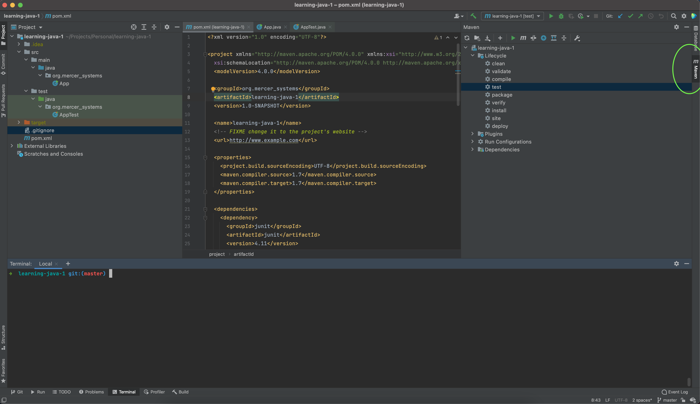
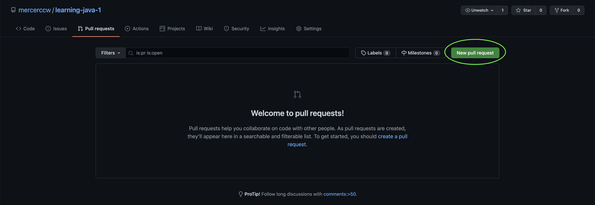

# Coding with Clayton | Lesson 1 : Java Edition

### Setup
1. Download IntelliJ IDE Community from [JetBrains](https://www.jetbrains.com/idea/download/)


2. To clone this project, run this command in the directory you want the project to exist

```
git clone https://github.com/mercerccw/learning-java-1.git
```

3. Ensure Java is installed by running `java -version`. The version needs to be [Java 8](https://www.oracle.com/java/technologies/javase/javase-jdk8-downloads.html), so if you don't
have it, download it and run `java -version` again. 


4. Open the project with IntelliJ and verify that Maven is present on the top right of the window
   

   
5. Run the `test` command and watch the tests fail

### Assignment
1. In the terminal, create a new git branch using this command
   ```
   git checkout -b <insert your name>-solution
   ```
   To ensure that the branch was created, run `git status`
   

2. You will be writing the code in the `src/main/java/org.mercer_systems/App.java` class' methods
that satisfies the test cases in `src/test/org.mercer_systems/AppTest.java`
   

3. Write clean code that passes the test cases and then commit and push your changes 
   in a Pull Request into the `master` branch

### How to commit and push your answers
1. Run 
   ```
   git status
   ```
   to see which files you've changed


2. To stage your changes, run
   ```
   git add .
   ```
   
3. Next commit your changes by running
   ```
   git commit -m "<insert commit message here>"
   ```
   For the commit message, something like `Added solutions` will work fine.
   

4. Now push your git branch with the newly created and committed changes to GitHub
using this command
   ```
   git push -u origin <insert branch name>
   ```
   (probably `<insert your name>-solution` from an earlier step)


5. Go to the [repository](https://github.com/mercerccw/learning-java-1/pulls) and create
a new Pull Request
   


6. Fill out the information 
   (
   ensure that you select your branch as the `compare` and `master` is the base branch
   ), put a meaningful description in the PR, add `mercerccw` as a reviewer, and submit the PR for review.
   

7. Fun fact! The GitHub repository will tell me if your code passed or failed in the review, so good luck! 